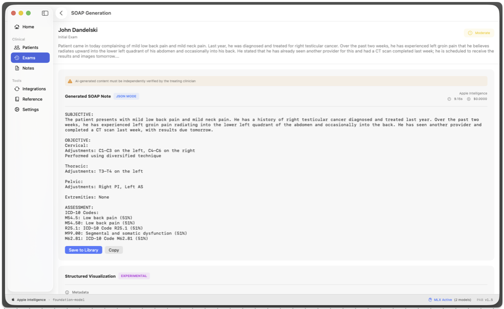

# Private Intelligence for Modern Practices

- Building solutions that don't depend on frontier models

---

# About Me

- Independent Developer 
- Spent 35 years in enterprise environments
- Focused on agentic development and building

---

# Why Apple Native

- Apple Foundation Models are available on 30+ Apple device models
- MLX allows developers to train models on Apple Silicon
- Privacy First Approach to data
  
---

# How I Built the application (in 3 weeks)

- Learn MLX framework
- Learn SwiftUI
- Learn xCode

---

# Building the MLX Models

- Real practitioner notes + accuracy-reviewed synthetic notes
- Implement a Python workflow to build tensors

---

# Why Tensors Matter

- Tensors encode language into trainable data
- Result: Models that understand clinical documentation as written

---

# Data Processing: Notes → Models

- **Extract & Annotate** - Parse raw notes for clinical findings, diagnoses, anatomical references, treatment codes
- **Build Domain Vocabulary** - Create terminology mappings from actual practitioner language (not textbook terms)
- **Convert to Training Tensors** - Format data for MLX: optimized vectors ready for neural network training

---

# Neural Network Training: MLX + Apple Silicon

- **Input: Training Tensors** - From data processing step, ready for model training
- **Metal-Accelerated Training** - Apple Silicon GPU optimization via MLX framework
- **Output: 3 Specialized Models** - ICD-10, CPT, Vertebral Level ready for inference

---

# Application Workflow: Dictation → Intelligence → Note

**Input:** Examination 

**Processing:** 3 MLX Models Run in Parallel (<50ms)
- ICD Classifier → M54.5, M99.03
- Vertebral Detector → L4-L5 lumbar segments
- CPT Classifier → 98940, 97110

**Output:** Complete SOAP Note with Codes
- Subjective/Objective: Clinical narrative
- Assessment: Diagnoses with ICD codes
- Plan: Procedures with CPT codes + treatment details

---

# Integration

---

# What I Learned

- Generic models and specialized training are powerful
- Modern hardware can handle complex NLP

---

# Contact

- Email: matthew@paz.land
- GitHub: https://github.com/mpazaryna
