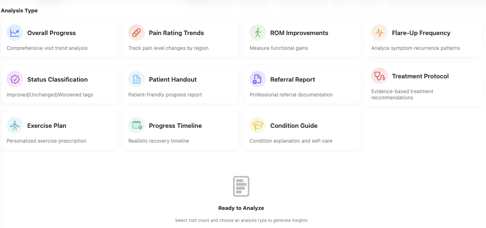

# Private Intelligence for Modern Practices

- Building solutions that don't depend on frontier models

---

# About Me

- Independent Developer 
- 35 years experience in full stack development
- Focused on agentic software development

---

# What I've Built

- Apple Native using MLX and Apple Foundation Models 
- Medical notation application
- Specs, Unit Tests, Integration and E2E Tests 
- 100% on device

---

# Why Apple Native

- Partner asked 'can we make this more Star Trek like'
- Apple Foundation Models are available on 30+ devices
- MLX Framework allows models to be trained on Apple Silicon 
  
---

# Collect Source Material and Process

- **Collect** - Practitioner notes 
- **Build** - Synthetic notes
- **Extract** - Parse notes for findings, anatomical references, treatment codes
- **Output** - Tensors aka optimized vectors

---

# Extracting Data

```python
def extract_icd_codes(text):
    """
    Extract ICD-10 codes from ASSESSMENT section.

    Handles formats:
    - Neck pain — M54.2
    - ● Description | CODE
    - M54.2 Cervicalgia
    """
    codes = []

    # Pattern 1: Bullet format with — or | separator
    # ● Description — M54.2 or ● Description | M54.2
    bullet_pattern = r'[●•]\s*[^—|]+[—|]\s*([A-Z]\d{2}\.?\d+[A-Z]?)'
    matches = re.findall(bullet_pattern, text)
    for code in matches:
        # Filter out vertebral levels (C1-C7, T1-T12, L1-L5, S1-S5)
        if not re.match(r'^[CTLS]\d{1,2}$', code):
            codes.append({'code': code, 'description': ''})

    # Pattern 2: Traditional format (M54.2 Description)
    if not codes:  # Only use if bullet pattern didn't find anything
        traditional_pattern = r'\b([A-Z]\d{2}\.\d+[A-Z]?)\s+([^\n]+)'
        matches = re.findall(traditional_pattern, text)
        for code, description in matches:
            # Filter out vertebral levels
            if not re.match(r'^[CTLS]\d{1,2}', code):
                codes.append({'code': code, 'description': description.strip()})

    return codes
```

---

# Build Models

## Step 1
- **Transform** - Create terminology mappings from practitioner language 
- **Output** - Tensors aka optimized vectors

## Step 2
- **Transform** - Using the MLX framework
- **Output** - Custom specialized models 

---

# Tensor to MLX

```python

  import mlx.core as mx
  import numpy as np
  from safetensors.numpy import save_file as save_safetensors

  # Get trained model parameters (MLX arrays)
  params = model.parameters()  # Returns nested dict of MLX arrays

  # 1. Flatten parameter tree and rename to MLX standard format
  mlx_params = {}
  name_mapping = {
      "token_embedding.weight": "embedding.weight",
      "linear1.weight": "layers.0.weight",
      "linear1.bias": "layers.0.bias",
      "output.weight": "classifier.weight",
      "output.bias": "classifier.bias"
  }

  for key, value in params.items():
      mlx_key = name_mapping.get(key, key)
      mlx_params[mlx_key] = value

  # 2. Save as MLX format (.npz)
  mx.savez("model.npz", **mlx_params)

  # 3. Convert MLX arrays → numpy → safetensors (for compatibility)
  numpy_params = {
      key: value.numpy().astype(np.float32)  # MLX-Swift needs float32
      for key, value in mlx_params.items()
  }
  save_safetensors(numpy_params, "model.safetensors")
```

---

# Application: Exam → Process -> JSON

- Input: Examination
- MLX Models Run in Parallel
- Apple Intelligene with MLX results
- JSON response
- Save JSON to SwiftData

---

# Process: 700-900ms

- Phase 1: MLX Analysis - Run all 3 processors in parallel
- Phase 2: Apple Intelligence - Prompt with MLX results

<br/>

**Note:** Apple Intelligence has a 4k token limit

---

# MLX Processors run in parallel

```swift
private func runMLXAnalysis(on text: String) async -> (
    icd10: [ICD10Suggestion],
    vertebral: VertebralAnalysisResult,
    cpt: CPTAnalysisResult
) {
    async let icd10Task = icd10Processor.processWithMLX(text)
    async let vertebralTask = vertebralProcessor.processWithMLX(text)
    async let cptTask = cptProcessor.processWithMLX(text)

    let (icd10Results, vertebralResults, cptResults) = await (icd10Task, vertebralTask, cptTask)

    return (icd10: icd10Results, vertebral: vertebralResults, cpt: cptResults)
}
```

---

# Output

```json
{
  "subjective": "Patient reported mild neck, mid-back, and low back pain. She also experienced right shoulder pain when extending her arm behind her head, which she could do easily with her left. Patient has a background in gymnastics and expressed a desire to perform a backbend again.",
  "objective": {
    "cervical": {
      "adjustments": ["C1–C3 on the right using diversified technique"],
      "notes": "Performed diversified technique on C1–C3 on the right"
    },
    "thoracic": {
      "adjustments": [
        "T2–T4 on the left",
        "anteriorly from T5–T8"
      ],
      "notes": "Performed adjustments on T2–T4 on the left and anteriorly from T5–T8"
    },
    "lumbar": {
      "adjustments": [],
      "notes": ""
    },
    "pelvic": {
      "adjustments": [
        "Right PI",
        "Left AS"
      ],
      "notes": "Adjusted pelvis for Right PI and Left AS"
    },
    "extremities": {
      "right_shoulder": {
        "adjustments": [
          "Right SC joint",
          "Right AC joint",
          "correction of right anterior–inferior humerus"
        ],
        "notes": "Performed adjustments on Right SC joint, Right AC joint, and correction of right anterior–inferior humerus"
      }
    }
  },
  "assessment": {
    "icd10_codes": [
      {"code": "M79.672", "description": "Pain in thoracic spine"}
    ],
    "cpt_codes": [
      {"code": "98941", "description": "Chiropractic manipulative treatment (CMT); spinal, 3-4 regions"}
    ]
  },
  "plan": "Amanda will return in 2–4 weeks for follow-up care."
}
```

---

# Additional Analysis (Extremely Exciting Aspect)



---

# Patient Visit Summary

```swift
//
//  PatientVisitSummary.swift
//  ContentKit
//
//  Patient Visit Trend Analysis template
//

import Foundation

/// Patient Visit Trend Analysis template (markdown-based)
enum PatientVisitSummaryTemplate {
    /// Patient Visit Trend Analysis - Analyze individual patient progress across multiple visits
    static let summary = PromptTemplate(
        name: "Patient Visit Trend Analysis",
        category: "Trends",
        content: TemplateLibrary.loadMarkdown("PatientVisitSummary"),
        metadata: PromptMetadata(
            tags: ["trends", "patient", "progress", "clinical-analysis"],
            notes: "Analyzes individual patient progress across visits - Phase 1 MVP"
        )
    )
}
```
---

# Template: Patient Summary

```text
You are creating a patient-friendly summary of their visit and follow-up recommendations.

## TASK:
Convert the clinical SOAP note into clear, understandable language for the patient. Focus on:
1. What we found today
2. What we treated
3. What you should do at home
4. When you should return
5. What improvement to expect

## GUIDELINES:
- Use simple language (avoid medical jargon)
- Explain WHY recommendations matter
- Be encouraging but realistic
- Include specific, actionable instructions
- Address common patient questions

## OUTPUT FORMAT:

### Your Visit Summary - [Date]

Convert this SOAP note for the patient:

{{input}}
```


# What I Learned

- Generic models and specialized training are powerful
- Modern hardware can handle complex natural language processing
- Build an elegant architecture AND maintain domain independence

---

# Contact

- Email: matthew@paz.land
- GitHub: https://github.com/mpazaryna
